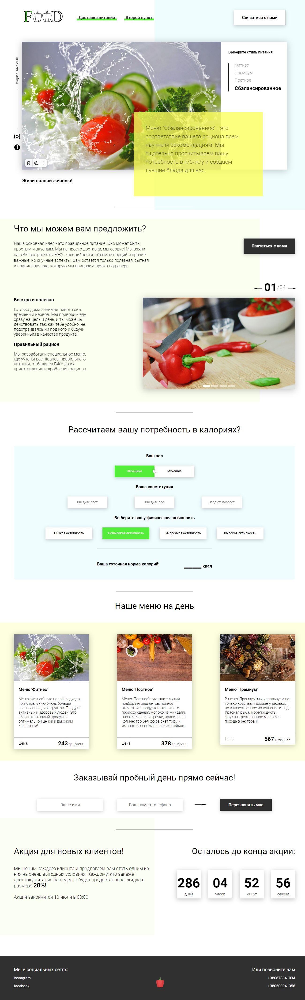

# p_Food
(P - project) A project on proper nutrition. I tried to implement the correct modular structure.   
Created - tabs, modal window, timer, slider, calculator, getting cards from the database. 
Used - Fetch API request, Asynchronous Code, Modular project construction, Webpack, Babel.

